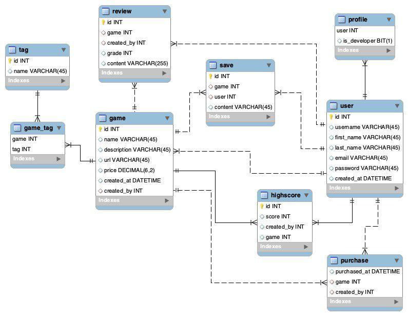

# wsd2018-project

CS-C3170 Course Project:
Online JavaScript game store; a Django application.

Application is [live at Heroku](https://afternoon-headland-18234.herokuapp.com/).

## Collaborators

* Juho Jokela - 718554
* Touko Hallasmaa - 718208
* Hien Cao - 716718

## TOC

- [wsd2018-project](#wsd2018-project)
  - [Collaborators](#collaborators)
  - [TOC](#toc)
  - [Project description](#project-description)
    - [Core features](#core-features)
      - [Authentication](#authentication)
      - [Purchasing Games](#purchasing-games)
      - [Playing Games](#playing-games)
      - [Searching Games](#searching-games)
      - [Adding Game](#adding-game)
      - [Statistics](#statistics)
      - [Updating a game](#updating-a-game)
      - [Saving/Loading](#savingloading)
      - [Third-Party Login / Logout](#third-party-login--logout)
    - [Extra](#extra)
      - [Tests](#tests)
      - [Reviews](#reviews)
      - [REST API](#rest-api)
      - [Highscores](#highscores)
  - [API](#api)
    - [Models](#models)
      - [Profile](#profile)
      - [Game](#game)
      - [Purchase](#purchase)
      - [Save](#save)
      - [Highscore](#highscore)
      - [Review](#review)
      - [Tag](#tag)
    - [Paths and views](#paths-and-views)
      - [Core](#core)
      - [Profile views and paths](#profile-views-and-paths)
      - [Game views and paths](#game-views-and-paths)
      - [Review view and paths](#review-view-and-paths)
      - [REST API](#rest-api-1)
  - [Management, collaboration and contributing to project](#management-collaboration-and-contributing-to-project)
    - [Order of work](#order-of-work)
    - [Timetable](#timetable)
    - [Reflection](#reflection)

## Project description

This repository contains the source-code for an online JavaScript game store. The project is developed during the span of Web Software Development (CS-C3170) -course and the project instruction can be found from [here](https://plus.cs.hut.fi/wsd/2018-2019/project/project/).

A rough mockup of the visuals of the web application can be seen [here](https://app.moqups.com/juho.i.jokela@gmail.com/XX8tNXjSen/view).

The live version of the application is available [here](https://afternoon-headland-18234.herokuapp.com/).

Instructions on how to use the service are available [here](./docs/Instructions.pdf).

The project is written in Python (3+) and it utilizes the Django framework. The authentication is provided by third-party Single-Sign-On (GitHub). In addition to this, we use Foundation 6.5.1 for faster templating with columns. We use vanilla JavaScript (ES6), jQuery for some components provided by Foundation and Babel for final compilation to ES5. Babel build is ran with a Node.js script.

To ease the development and maintenance we have decided to split this project into five apps. These are:

* Core
  * Common templates and resources
* User
  * Anything related to users
* Game
  * Anything related to games, purchases etc.
* Review
  * The community aspect of the web application
* APIS/REST API
  * Cross-Domain /GET requests for developers to query data

### Core features

#### Authentication

We plan on using the model `AbstractUser` (Django default User) and the build-in Django authentication. We extend the Model with simple OneToOne-relation. We will enable developers to also play games and regular users to promote themselves as developers, even if they had not done so when originally registering.

User may register and login with [Django Authentication Login](https://docs.djangoproject.com/en/2.1/topics/auth/default/#how-to-log-a-user-in) or with [Third-Party Login](#third-party-login--logout).

#### Purchasing Games

The purchases are handled with [payments API](http://payments.webcourse.niksula.hut.fi/). This is not a real banking API but it mimics some common features that such an API could have. We are not interested in the balance of the accounts, but that the transactions are safe and money gets transferred as intended (uniqueness is ensured by using uuids).

#### Playing Games

Conditions to get to play:

* User must be authenticated
* Provided link to play must be valid as we do not host the games
* The user must have purchased the game, hence adding it to their library. This must be done even if the game was free; as it ensures better data reliability (such as amount of daily purchases).

The games are shown on our website using `<iframe>`s.
Users can store their play details such as score, and game state if the game so allows.

All additional information can be found below e.g. [Saving/Loading](#Saving/Loading).

#### Searching Games

Games can be sought by name, category and developer name. This is implemented with a single search input, with Twitter like hashtags and handles. The search box provides you with suggestions based on your current input. Search is one-dimensional and only simple, single attribute, searches are currently possible. Current implementation is both efficient and easy to maintain, though rather limited.

#### Adding Game

Conditions for adding games:

* User must be authenticated (as developer)
* The name of the game must be unique
* The URL must be unique and valid (simple validation with Django)

Games are added and modified with a a simple form. Deletion of games is only possible if a game has not yet been purchased. Deletion is done via a simple delete button. If games were deletable, even if they had been purchased, it would require us to take into account the balance of the accounts and that is something we are not interested in.

#### Statistics

For developers:

* number of purchases (all/game):
  * purchases this month/year/total
* cumulative revenue (all/game)

For players:

* purchase history

#### Updating a game

Same conditions as in [adding games](#Adding\ Game) apply.
Changing the cost of the game does not affect the old purchases in any way so that they are still valid (price is what it was at the hour of purchase).

#### Saving/Loading

The raw game states (`gameState` JSON attribute) are stored into the PostgreSQL database. This field will be characters (encoded with Base64). This is a separate table.

When a load is made, we fetch the raw JSON (stringified) from the database and parse it in the browser.

When a save is made, we `POST` the JSON and store it to the aforesaid table.

#### Third-Party Login / Logout

Users do not have to "register" when an user tries to login and if a user with those login credentials do not exist, a user is created. We plan on using GitHub for login/logout.

### Extra

List of the extra features implemented.

#### Tests

We have Unit tests for the models of the applications. These tests are to ensure that the database does not get easily contaminated. We did not implement tests for any methods, not even those that do modify the data on the server. These could have been implemented if we had had more time. However, the most crucial tests, tests for models, are done.

#### Reviews

Who can review:

* Anyone who is authenticated and purchased the game, the reviewer can even be the developer of the game

An user can submit a review with the grade. Your review, and the reviews of others, can be seen when viewing the details of a game.

#### REST API

We plan on having a small API for the developers. We will have an application that stores the APIKeys into a table. These APIKeys are used instead of the regular authentication for Cross-Domain requests for the REST API (`/api/v1/{some_additional_path}`).

Developers can generate and remove APIKeys from their profile page.

Further information about the available APIs can be seen [here](./API.md).

#### Highscores

Users can see highscores for games.

## API

In this chapter all the Models of the web app are listed, as they are in the database below.



### Models

List of our models and their descriptions

#### Profile

Extends the default Django user model.

```python
user = models.OneToOneField(
  User,
  on_delete=models.CASCADE,
  primary_key=True
)
```

In addition to the extended fields a profile object contains:

```python
is_developer = models.BooleanField(default=False)
email_confirmed = models.BooleanField(default=False)
```

#### Game

Contains the basic details of the game.

```python
name = models.CharField(unique=True, max_length=128)
description = models.TextField(blank=True)
url = models.URLField(unique=True)
price = models.DecimalField(
  default=0,
  max_digits=6,
  decimal_places=2,
  validators=[MinValueValidator(0)]
)
created_at = models.DateTimeField(auto_now_add=True)
updated_at = models.DateTimeField(auto_now=True)
created_by = models.ForeignKey(
  Profile,
  null=True,
  related_name='uploads',
  on_delete=models.SET_NULL
)
tags = models.ManyToManyField(
  'Tag',
  related_name='tags',
  blank=True
)
```

#### Purchase

Contains purchase information.

```python
id = models.UUIDField(primary_key=True, default=uuid.uuid4, editable=False)
purchased_at = models.DateTimeField(auto_now_add=False, null=True, blank=True, editable=True)
price = models.DecimalField(max_digits=6, decimal_places=2)
ref = models.IntegerField(null=True)
game = models.ForeignKey(
  Game,
  related_name='purchases',
  on_delete=models.CASCADE
)
created_by = models.ForeignKey(
  Profile,
  related_name='purchases',
  on_delete=models.CASCADE
)
```

#### Save

Contains the information about the save file

```python
game = models.ForeignKey(
  Game,
  on_delete=models.CASCADE
)
user = models.ForeignKey(
  Profile,
  on_delete=models.CASCADE
)
content = models.BinaryField()
```

#### Highscore

Contains the high score information

```python
score = models.IntegerField()
game = models.ForeignKey(
  'Game',
  on_delete=models.CASCADE
)
created_by = models.ForeignKey(
  Profile,
  on_delete=models.CASCADE
)
```

#### Review

Contains the review information

```python
game = models.ForeignKey(
  Game,
  on_delete=models.CASCADE,
  related_name=rn
)
created_by = models.ForeignKey(
  Profile,
  on_delete=models.CASCADE,
  related_name=rn
)
created_at = models.DateTimeField(
  auto_now_add=True,
)
grade = models.IntegerField(
  default=0,
  validators=[
    MinValueValidator(1),
    MaxValueValidator(5)
  ]
)
content = models.TextField(
  blank=True
)
```

#### Tag

Contains the tag name of game catagories

```python
name = models.CharField(max_length=32, unique=True)
```

List of model attributes

### Paths and views

#### Core

* {{ base_url }}/ – Home

#### Profile views and paths

* {{ base_url }}/oauth/ – Social authentication
* {{ base_url }}/signin/ – Use internal signin views
* {{ base_url }}/signup/ – Use internal signup views
* {{ base_url }}/profile/ – Separate profile view

#### Game views and paths

* {{ base_url }}/games/ – Browse all games / create a new game (POST - Developer)
* {{ base_url }}/games/search/{{ criteria }} – Search from all games by criteria
* {{ base_url }}/games/libary/ – Browse games user has purchased
* {{ base_url }}/games/library/search/{{ criteria }} – Search from purchased games by criteria
* {{ base_url }}/games/uploads/ - Browse games user has uploaded
* {{ base_url }}/games/:id/ – View / Update a game
* {{ base_url }}/games/:id/play/ – Play a game

#### Review view and paths

* {{ base_url }}/{{ target }}/review/

#### REST API

See [APIs](./API.md) for further details.

## Management, collaboration and contributing to project

See [guidelines](./CONTRIBUTING.md) for contributing.

### Order of work

At this point we have done the initial planning and design work and will start focusing to the project itself straight after christmas vacations. In addition to semi-regular face-to-face meetings arranged as needed, we will use tools provided by GitLab repository manager alongside with [Trello](https://trello.com).

### Timetable

We set out the deadlines for each task to be somewhat reasonable, so that the core application (fullfilling all required features) is developed first, and only after that the additional features will be implemented. We are planning to use Trello cards to track each issue more subtly.

| features                                | deadline  | assignee | core | Status |
| --------------------------------------- | --------- | -------- | ---- | ------ |
| [Authentication](#Authentication)       | 16.1.2019 | Juho     | x    | ok     |
| [Third-Party Login](#Third-Party-Login) | 16.1.2019 | Juho     | x    | ok     |
| [Adding Game](#Adding-Game)             | 22.1.2019 | Juho     | x    | ok     |
| [Purchasing Games](#Purchasing-Games)   | 24.1.2019 | Touko    | x    | ok     |
| [Playing Games](#Playing-Games)         | 31.1.2019 | Juho     | x    | ok     |
| [Searching Games](#Searching-Games)     | 31.1.2019 | Hien     | x    | ok     |
| [Updating Game](#Updading-a-game)       | 31.1.2019 | Juho     | x    | ok     |
| Core templates                          | 31.1.2019 | Hien     | x    | ok     |
| [Saving/Loading](#Saving/Loading)       | 7.2.2019  | Touko    | x    | ok     |
| [Statistics](#Statistics)               | 10.2.2019 | Juho     | x    | ok     |
| [Reviews](#Reviews)                     | 16.2.2019 | Juho     | -    | ok     |
| [REST API](#REST-API)                   | 16.2.2019 | Hien     | -    | ok     |
| [Highscores](#Highscores)               | 16.2.2019 | Juho     | -    | ok     |
| Custom JavaScript game                  | 24.2.2019 | Touko    | -    | ok     |
| Social media sharing                    | 24.2.2019 | Touko    | -    | ok     |
| Polishing                               | 24.2.2019 | Touko    | -    | ok     |

### Reflection

The team worked together well. We met almost weekly and worked on many of the features as pairs, as this, by some, is most effective way of working with cognitive tasks.

We did not use any time tracker for this project but our estimate was that each of us spent somewhere between 120 to 140 hours on it.

See [this document](./REFLECTION.md) for a more in-depth reflection.
