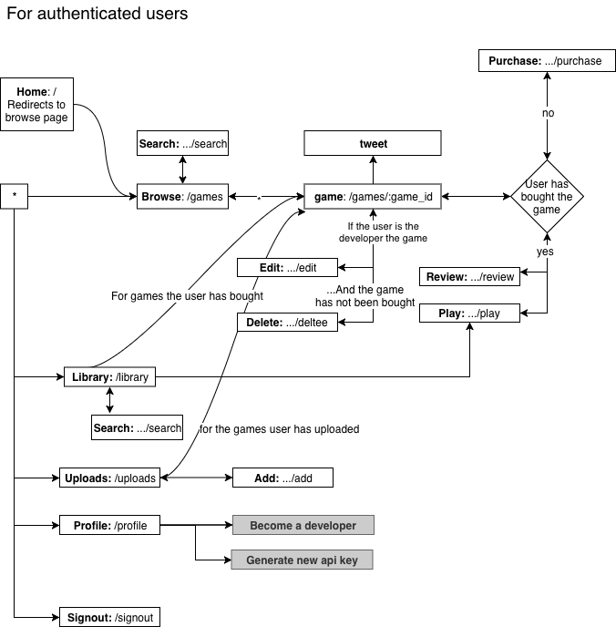

# WSD2018 Project – Reflection

* Juho Jokela - 718554
* Touko Hallasmaa - 718208
* Hien Cao - 716718

## Heroku

[Live website](https://afternoon-headland-18234.herokuapp.com)

The superuser credentials may be used for administrative purposes

* username: superuser
* password: super
* As the email confirmation is implemented by printing the activation link to the
  console, you will need to use the provided credentials to activate your account
  and email manually. Remember to checkmark both `is_authenticated` **AND** `email_confirmed` (in Users / Profile model) before attempting to Sign in.

## Task allocation

| features               | assignee | requirement                      |
| ---------------------- | -------- | -------------------------------- |
| Authentication         | Juho     | Authentication                   |
| Third-Party Login      | Juho     | 3rd party login                  |
| Adding Game            | Juho     | Basic developer functionalities  |
| Purchasing Games       | Touko    | Basic player functionalities     |
| Playing Games          | Juho     | Basic player functionalities     |
| Searching Games        | Hien     | Basic player functionalities     |
| Updating Game          | Juho     | Basic developer functionalities  |
| Core templates         | Hien     | General                          |
| Saving/Loading         | Touko    | Save/load and resolution feature |
| Statistics             | Juho     | Basic developer functionalities  |
| Reviews                | Juho     | Custom                           |
| REST API               | Hien     | RESTful API                      |
| Highscores             | Juho     | Game/service interaction         |
| Custom JavaScript game | Touko    | Own game                         |
| Social media sharing   | Touko    | Social media sharing             |
| Polishing              | Touko    | General                          |

## Self-reflection

| feature                                                                 | points |
| ----------------------------------------------------------------------- | ------ |
| [Authentication](#Authentication)                                       | 200    |
| [Basic player functionalities](#Basic-player-functionalities)           | 300    |
| [Basic developer functionalities](#basic-developer-functionalities)     | 200    |
| [Game/service interaction](#Game/service-interaction)                   | 200    |
| [Quality of work](#Quality-of-work)                                     | 75     |
| [Non-functional requirements](#Non-functional-requirements)             | 150    |
| [Save/load and resolution features](#Save/load-and-resolution-features) | 100    |
| [3rd party login](#3rd-party-login)                                     | 100    |
| [RESTful API](#RESTful-API)                                             | 100    |
| [Own game](#Own-game)                                                   | 100    |
| [Mobile Friendly](#Mobile-Friendly)                                     | 50     |
| [Social media sharing](#Social-media-sharing)                           | 40     |

### Authentication

> 200/200

* We decided to implement only one 'type' of users. Users have is_developer flag in their profile,
  which indicates whether the user can add games of his own. Any user can become a developer
  after registering via his profile page.
  * Thus the basic functionality between developer / player wont differ much, as the developer is able to do
    everything the player can do.
* Email confirmation is implemented by printing the activation link to the
  console.
* We use additional field `email_confirmed` in Profile model to allow us disabling users with the default field `is_authenticated` (banning them for e.g. posting profanities in their reviews or cheating in a game).

### Basic player functionalities

> 300/300

* At first we had some issues regarding to the payment processing, but it was due to not reading instructions
  completely. (Due to two different checksums). This issue was tackled after reading the instructions again.
* Test game provided in the project description **will not work** in the live version of the website
  **if requested via https** (as with other games served via http, so **you may have to manually edit
  the address bar** to play the game)
* Custom search functionality implemented. Users are able to search games by name, @author or #tag
  * Tags are implemented via adding #them to the game description.

### Basic-developer-functionalities

> 200/200

* Developers are able to delete games before they have been purchased by anyone
  * This is implemented to prevent developers from 'stealing' the games from the users that have already purchased a game.
  * Alternatively, we would have had to implement account balance system.
* Developers can modify games any time
  * Including price. However, this wont have an effect on the purchases made before the edit.
* Statistics implemented.
  * Developer can view all purchases on his games in the uploads page
  * Statistics to single game can be found (for the developer) under game details page
  * Total purchase statistics can be found in the profile page

### Game/service interaction

> 200/200

* Implementation went smoothly and works as described

### Quality of work

> 80/100

* At first we intended to write the javascript directly without compiling it first,
  this leaded to messy code quite fast (as we used global scope instead of imports)
  * Instead, we bundle the code from ES6 to ES5 with a npm script (a webpack script). Though this slows down the development process a bit, we implemented it so late into the project, that it did not matter. If we would have done this earlier we would have had to use webpack-dev-server for automated compiling.
* Django framework took some time to get used to, and there may be some inconsisencies.
* We wrote tests for the models. These ensure that the database should not be easily contaminated with faulty data.

### Non-functional requirements

> 150/200

* Instead of gitlab issues, we used Trello to track the status of each pre-determined feature.
* Before starting the work on the project, we decided on a git workflow ([CONTRIBUTING.md](./CONTRIBUTING.md))
  which we stuck throught the span of the project.
  With this pre-determined workflow everyone was able to work invidually.
* We made sketches of the UI and tried to figure out the best UX with [Moqups](https://app.moqups.com/XX8tNXjSen/view/).

### Save/load and resolution features

> 100/100

* Save data is stored to the database as Base64 string, and decoded before returning to the client.
* Each player can have one save per game. Saving a game overwrites old save.

### 3rd party login

> 100/100

* Implementation went smoothly and works as described (GitHub)

### RESTful API

> 100/100

* Implementation went smoothly
* Rest api documentation can be found at [API.md](./API.md) in the project root.

### Own game

> 100/100

* The game has its own [repository](https://version.aalto.fi/gitlab/hallast1/invaders), but can also be found from the
  project root under 'game' folder.

### Mobile Friendly

> 100/100

* Even though the games may not work on the mobile (custom game for example), the site itself is responsive and tested
  with various screen sizes. Also the resolution set by games is respected even in the mobile view, so this can 'break'
  the responsive design.

### Social media sharing

> 40/50

* Twitter sharing at Game details and Play site (using twitter cards). As we don't have implemented thumbnails
  for the games, we don't inject any image to the card.
  (According to the Twitter cards guidelines, the image should be unique representing the content of a
  given web page.)

### Custom

* Users can review (and grade) games and read reviews made by others.
* We wanted to provide users with some social media aspects of our own.

## Navigation for authenticated users

The relationships between pages is roughly presented in the following graph (for authenticated users):

